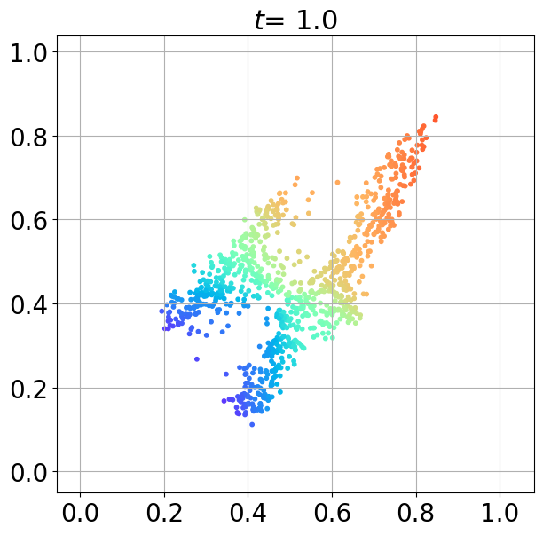

# GradNetOT

  
  
  
  
  

**GradNetOT** learns a Monge map between probability densities by training a monotone gradient network (mGradNet) [1, 2] to solve the Monge–Ampère equation.

## References

1. S. Chaudhari*, S. Pranav* and J. M. F. Moura, "Gradient Networks," in IEEE Transactions on Signal Processing, vol. 73, pp. 324-339, 2025, doi: 10.1109/TSP.2024.3496692.
2. S. Chaudhari*, S. Pranav* and J. M. F. Moura, "Learning Gradients of Convex Functions with Monotone Gradient Networks," ICASSP 2023 - 2023 IEEE International Conference on Acoustics, Speech and Signal Processing (ICASSP), 2023, doi: 10.1109/ICASSP49357.2023.10097266.
