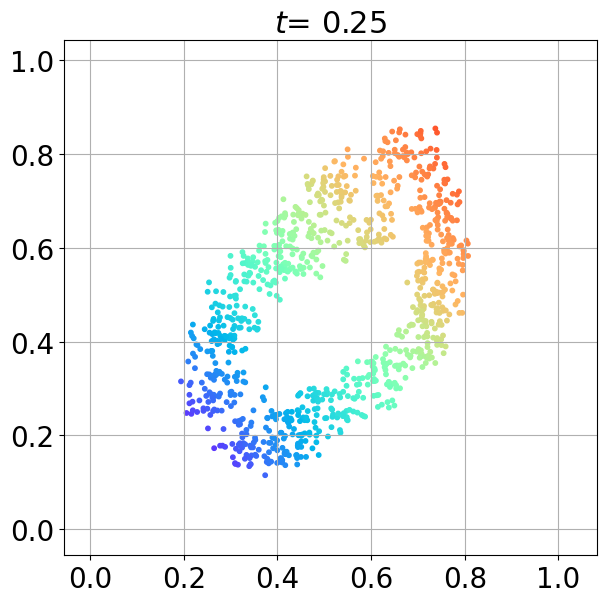
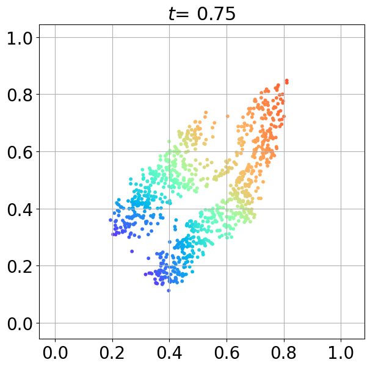

# GradNetOT

  
  
  
  
  

**GradNetOT** learns a Monge map between probability densities \( p \) and \( q \) using a monotone gradient network (mGradNet) [1, 2] to solve the Monge–Ampère equation:

\[
p(x) = q(T(x)) \cdot \det \left( J_{T}(x) \right)
\]

Here, \( T \) is an mGradNet and therefore has a **positive semidefinite Jacobian**, meaning it corresponds to the **gradient of a convex potential**.

---

## References

1. S. Chaudhari*, S. Pranav* and J. M. F. Moura, "Gradient Networks," in IEEE Transactions on Signal Processing, vol. 73, pp. 324-339, 2025, doi: 10.1109/TSP.2024.3496692.
2. S. Chaudhari*, S. Pranav* and J. M. F. Moura, "Learning Gradients of Convex Functions with Monotone Gradient Networks," ICASSP 2023 - 2023 IEEE International Conference on Acoustics, Speech and Signal Processing (ICASSP), 2023, doi: 10.1109/ICASSP49357.2023.10097266.
